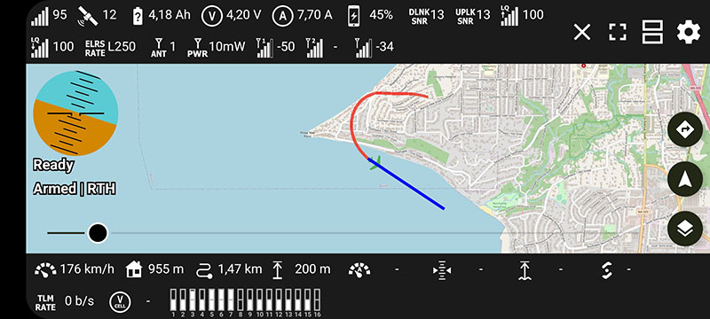
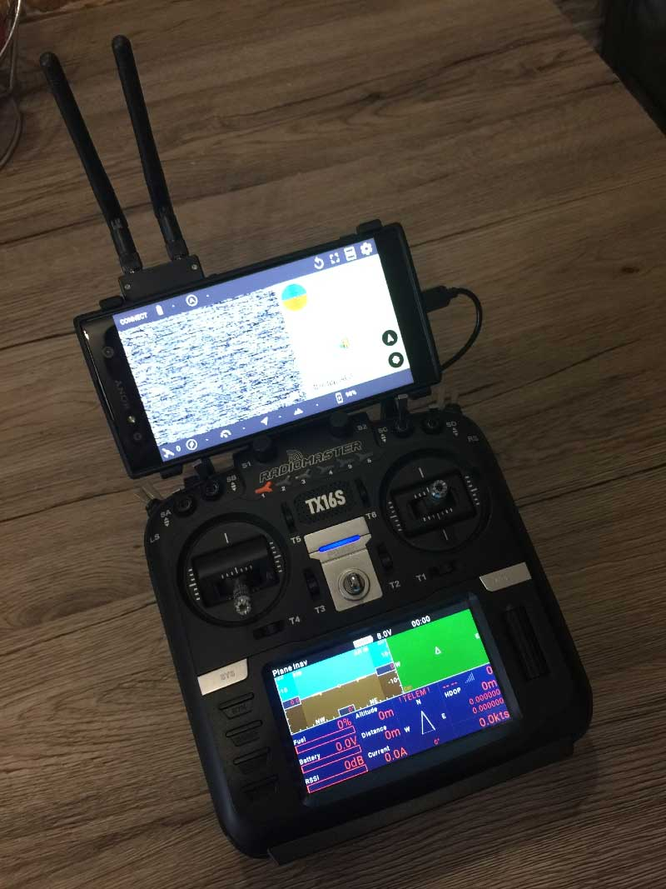

# Android Taranis SmartPort Telemetry / Roman Lut

This is fork of CrazyDude's excellent application https://github.com/CrazyDude1994/android-taranis-smartport-telemetry

 

This version contains support of ROTG01/ROTG02 video receivers with recording:

 

Latest build is available in Releases: https://github.com/RomanLut/android-taranis-smartport-telemetry/releases

I am contributing most bugsfixes and enchancements to Crasydude's repository. But due to significant differences in UI structure, some features are not merged:
- UVC video support, video recording, recording quality selection
- RC Channels display (mavlink only, 8ch only for Mavlink v1)
- Travelled distance display
- persistent fullscreen state
- stable ( no jittering ) sensors display
- better Altitude and Distance to home icons

Below is original Readme.md:

# Android Taranis SmartPort Telemetry Viewer

This android application let you view and record your taranis telemetry data in realtime.

# Hardware and connection
In order this to work you need additional hardware: inverter and bluetooth module (HC-05 or HC-06 or something else, also you don't need module and inverter if your transmitter has internal one)
One important thing: Module should be configured to work on 57600 baud rate, otherwise it won't work. 
Connect inverter to your Smart Port and then connect bluetooth module to the inverter. You now can connect your phone to your bluetooth module and view data

**upd: ** now you can use usb serial connection. More info here https://github.com/CrazyDude1994/android-taranis-smartport-telemetry/issues/47

## Tested modules

Currently we support classic BL,BLE and integrated bluetooth modules into your transmitter. We currently tested them on the HC-05, HC-06, HC-09, HM-10. Make sure that when using BLE module you should disable PIN code (if possible). For classic BL module to appear in the list, you should pair it to your Android device first.

## HC-06 With MOSFET inverter

## HC-06 Configuration

By default, HC-06 is configured for 9600bps. To configure, use any USB-to-serial converter and serial client. Mac and Linux can use Terminal `screen` command. Windows users can use [Putty](http://www.putty.org/)

HC-06 module will expect that each command will be entered very fast (AFAIR max 1s between letters). So the best option here is to open text editor, type commands there and then copy them one by one into serial software.

1. `AT+NAMEyournamehere` - no spaces!
1. `AT+PIN1234` - PIN, no spaces again
1. `AT+ENABLEIND0` (you can ommit this command if your module does not support it)
1. `AT+BAUD7` - set port speed to 57600

# Google Play
https://play.google.com/store/apps/details?id=crazydude.com.telemetry

# Beta program
I'm happy to announce that now you can apply for an open beta program, to test and use the most newest features as soon as possible.

You can apply for a beta here https://play.google.com/apps/testing/crazydude.com.telemetry

Please leave your feedback at [#47](https://github.com/CrazyDude1994/android-taranis-smartport-telemetry/issues/47)

# RCGroups Thread
https://www.rcgroups.com/forums/showthread.php?3284789-iNav-SmartPort-telemetry-viewer-and-logger

# Your module doesn't work?
Make sure you followed all the steps. If this doesn't help, you can ask for help by creating new issue with your module model. Also for quick support you can join our telegram group and ask for help there

# Telegram group
https://t.me/joinchat/Gf03BFXI2e48WMvzjLeIjw

# Say thanks
If you want to help or say thanks follow my yt channel:
https://www.youtube.com/channel/UCjAhODF0Achhc1fynxEXQLg?view_as=subscriber

or you can donate to my patreon: https://www.patreon.com/android_rc_telemetry

# Special thanks
hyperion11 - Ardupilot support

Alexey Stankevich - initial testing, feedback

Marios Chrysomallis - testing BLE support

Paweł Spychalski - project contribute, made a great video about the app (https://www.youtube.com/watch?v=0-AyP5Y7pCI)

AeroSIM RC - for sending their simulator for testing app from home (they have plugin to connect my app with their sim)

usb-serial-for-android - library creators (https://github.com/mik3y/usb-serial-for-android)
